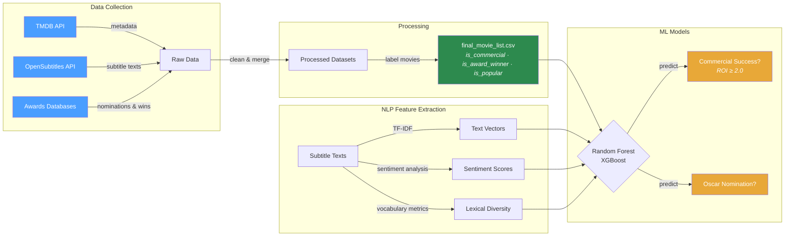

# Project — Data Pipeline & Analysis

This is where all the work happens: collecting data, processing it, and building models that predict movie success.

## What This Project Does



**In plain terms:** we take 7,400+ movies, analyze what people *say* in them (subtitles), combine that with financial data (budget, revenue) and award history, then train classifiers to predict whether a movie will be commercially successful or get an Oscar nomination.

## Directory Layout

```
project/
├── data/
│   ├── raw/                        Source data — do not modify
│   │   ├── tmdb_metadata/          76 yearly CSVs from TMDB API (1950–2025)
│   │   ├── subtitles/              ~7,400 subtitle .txt files (filename = TMDB movie ID)
│   │   ├── awards/                 Award ceremony data
│   │   └── oscars/                 Oscar nomination/win data
│   │
│   ├── processed/                  Cleaned, merged, labeled — ready for modeling
│   │   ├── final_movie_list.csv    Main dataset with success & award labels
│   │   ├── tmdb_enriched.csv       TMDB data + computed features (ROI, labels)
│   │   ├── tmdb_combined.csv       All 76 yearly TMDB CSVs merged into one file
│   │   ├── awards_master_partial.csv   Major award ceremonies (partial)
│   │   ├── awards_minor_categories.csv Minor award categories
│   │   ├── downloaded_movies.csv   Tracks which movies have subtitles downloaded
│   │   ├── download_log.csv        Full log of subtitle download attempts
│   │   └── audit_report.csv        Data quality checks and issues found
│   │
│   └── external/                   Third-party or manually curated data
│
├── reports/
│   └── figures/                    Generated visualizations
│       ├── budget_vs_revenue.png
│       ├── genre_comparison.png
│       ├── genre_distribution.png
│       ├── size_distribution.png
│       ├── subtitle_completion_rate.png
│       ├── year_comparison.png
│       └── year_distribution.png
│
├── project_setup.py                One-time scaffold script (initial directory setup)
├── requirements.txt                Python dependencies (pinned versions)
└── .env.example                    API key template — copy to .env and fill in
```

## Key Datasets

| File | What's in it | Size |
|------|-------------|------|
| `final_movie_list.csv` | One row per movie: id, budget, revenue, genres, title, `is_commercial`, `is_award_winner`, `is_popular` | ~1.6 MB |
| `tmdb_combined.csv` | All 76 yearly TMDB metadata files merged | ~14 MB |
| `tmdb_enriched.csv` | TMDB data + ROI calculations + success labels | ~2 MB |
| `awards_master_partial.csv` | Oscar and major ceremony nominations/wins | ~230 KB |
| `awards_minor_categories.csv` | Smaller award categories and ceremonies | ~310 KB |
| `subtitles/*.txt` | Raw subtitle text per movie (one file per TMDB ID) | ~7,400 files |

## Setup

```bash
# From the repository root:
pip install -r project/requirements.txt

# Copy the API key template and fill in your credentials:
cp project/.env.example project/.env
```

## Dependencies

See [`requirements.txt`](requirements.txt) for pinned versions.

| Category | Packages |
|----------|----------|
| Data | pandas, numpy |
| ML | scikit-learn, xgboost, imbalanced-learn |
| NLP | spacy, nltk, gensim |
| Visualization | matplotlib, seaborn, plotly |
| API access | requests, python-dotenv |
